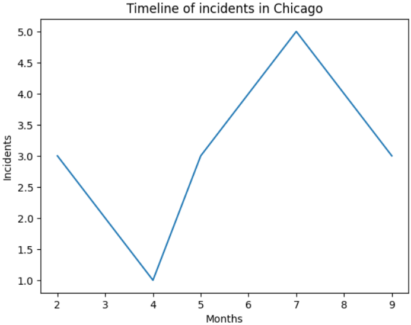

# Gun Violence in the US

## 1. Introduction

Gun Violence in the US is a Data Science authorial project developed in Pandas to analyze criminal indices based on gun shooting violence in the United States of America. Next there are some information about the dataset used in this project and questions, which will be answered through this project.

### 1.1 Dataset information

<a href="https://www.kaggle.com/datasets/whisperingkahuna/gunviolence1/data" target="_blank" rel="noopener noreferrer">Gun Violence in US</a> dataset comes from Kaggle and has data from January 1, 2024 to October 20, 2024 about gun shooting violence in the US. The meaning of the dataset’s data are described next:

<ul>
  <li>Incident ID: A unique identifier for each incident</li>
  <li>Date: The date of the incident.</li>
  <li>State: The US state where the incident occurred.</li>
  <li>City or County: The city or county within the state.</li>
  <li>Address: The specific address of the incident.</li>
  <li>Number of Killed: The number of people killed in the incident.</li>
  <li>Number of Injured: The number of people injured in the incident.</li> 
  <li>Number of Arrested: The number of people arrested in the incident.</li> 
  <li>Latitude: The latitude coordinate of the incident location.</li>
  <li>Longitude: The longitude coordinate of the incident location.</li>
</ul>

### 1.2 Questions to be answered

Next, there is a list containing questions which will be answered along the project development. These questions are based on the dataset possibilities and concerns about security in the US by the project’s author.

<ul>
  <li>What state and city have the most incident records? And during which month did the most of those incidents happen?</li>
  <li>What’s the number of victims and suspects killed in the city with the highest number of records? Are these numbers related in any way?</li>
  <li>Are there more suspects killed, injured or arrested? Are the results good?</li>
  <li>What’s the relation between victims killed and suspects arrested in each occurrence?</li>
  <li>Which state has the highest number of victims killed? And about suspects killed?</li>
  <li>Among the records, is there any address (street, avenue or road) that appears more than once? And, if so, what’s the number of victims killed and injured there?</li>
</ul>

## 2. Data analysis

### 2.1 Places and month with most incidents

Exploring the dataset, it was possible to realize that there are a state and a city which most appear throughout it. But who are they? Illinois is the state where there are the most records of incidents and one of its cities, called Chicago, it’s the city where there are the most records.

During the ten first months of 2024, it happened, at least, thirty-two (32) incidents of gun violence in Illinois. And, at least, twenty-five (25) ones in Chicago. Which means that around 78.13% of the incidents recorded in Illinois happened in Chicago.

About the months, when these incidents in Illinois happened, the one with the most part of records is July. Next, it’s possible to observe a graph which shows the timeline of incidents in this state.

  

 

There is an increase in terms of the number of incidents throughout the months in Illinois. At the end, it’s possible to see that there was a decrease.

Next, there is a graph which shows the timeline of incidents in Chicago. About it, it’s possible to analyze the increasing and decreasing of incident records.

  

 

Analyzing the previous graph, it’s possible to observe differences and similarities about its numbers in comparison to the Illinois graph. The two graphs present different numbers for some months. The month with the most part of incidents in Illinois presented six (6) records, but in Chicago this same month presented five (5) ones. And they show a similar increase of incidents until the seventh month, and, after that, a decrease.

### 2.2 Number of victims and suspects killed

About the number of victims and suspects killed in Chicago, the city with the most part of incidents recorded, there is a considerable difference between them. While there weren’t any suspects killed, the number of records of victims killed was almost a half from the total quantity of records. Next, there are two charts showing these two variables.

  

 

  

 

### 2.3 About suspects in the US

About the number of suspects killed, injured or arrested in the US, there is such a difference among them, which may make someone think whether these are good or bad results. Analyzing the following chart, it’s possible to note that the number of suspects arrested is bigger than the others. But is this a really good result?

  

 

In general, police officers in the US usually only kill someone if they’re causing risks of life to another person or a determined group of people. So, these numbers indicate good results in fact, because this means that police officers there were able to arrest suspects before they cause more problems and instead of killing them. This shows a good performance by the US police officers.

### 2.4 Relation between victims killed and suspects arrested

In terms of the relation between victims killed and suspects arrested in the US during the ten first years of 2024, there is an interesting difference. Through the next graph it’s possible to realize that there were more victims killed than suspects arrested when there were at least one of each of them recorded within the dataset.

  

 

This can indicate several possibilities, like suspects escaping from the police or a lesser number of suspects involved in the most occurrences than victims. Anyway, the difference isn’t very big, which, again, shows that the public security in the US is doing a good job.

### 2.5 States with the highest number of people killed

The dataset enables analyzing the states with the highest number of victims and suspects killed recorded. But who are they? Is there a relation among them? Observing the following graph, it’s possible to realize the three states with the highest number of victims killed.

  

 

The previous graph shows a small difference among the three states about this topic. This difference indicates a similarity about the dangers of living, or just spending time, in one of them. Although, there are some reasonable differences between them and the states with the highest number of suspects killed. Through the next graph, it’s possible to discern those differences.

  

 

Observing the previous graph, those differences mentioned before can be noted by perceiving that the states are not the same in the two graphs. There is another difference as well, the quantity of suspects killed is significantly lesser than victims killed.

As it was analyzed before, the relation between the number of victims killed and suspects arrested is quite good, because there is a small difference between the two variables. Then, what does this point out about this matter? It demonstrates, again, a nice accomplishment based on public security by the US.

### 2.6 Addresses and victims

Analyzing the dataset, it was concluded that there aren’t any addresses which appear more than once. To get this information, first it was filtered the “Address” column to get only streets, avenues and roads where gun incidents in the US were recorded. After that, it was used the mode, a statistical method, to find addresses which appeared more than once, but all of them just appeared one time in the dataset. And, because of that, it wasn’t possible to calculate the number of victims killed and injured at them.

## 3. Final conclusions

Throughout the development of this data science project, about gun violence in the US, some questions were answered based on the dataset used in it. Statistical methods were used and graphs were plotted to extract and visualize information from the data. This project was developed using Pandas, which is a Python library focused on data analysis.

Next, there is the project author’s name and the conclusion date of it. Feel free, and encouraged, to access his social media profiles, especially on <a href="https://github.com/Matheus-Pombeiro" target="_blank" rel="noopener noreferrer">GitHub</a> and <a href="https://www.linkedin.com/in/matheus-pombeiro/" target="_blank" rel="noopener noreferrer">LinkedIn</a>.

Matheus V. G. Pombeiro

November 10, 2024

